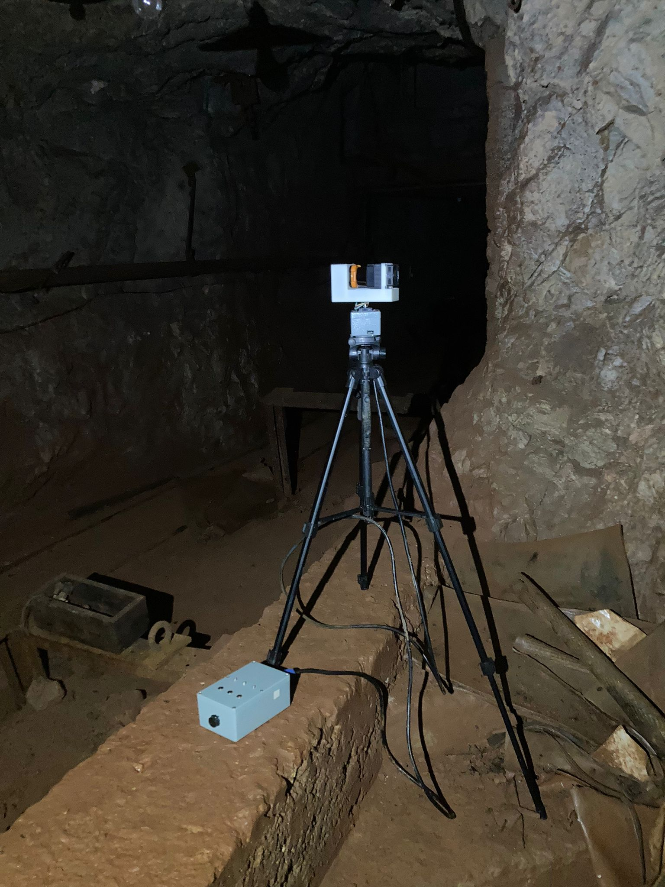
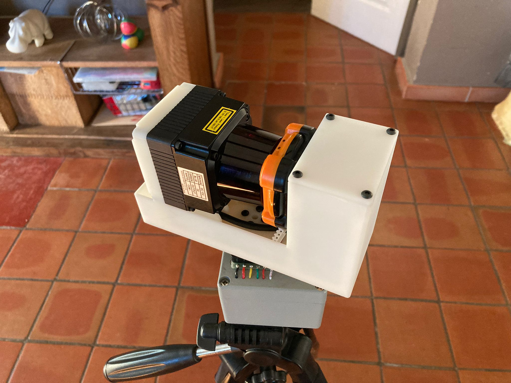
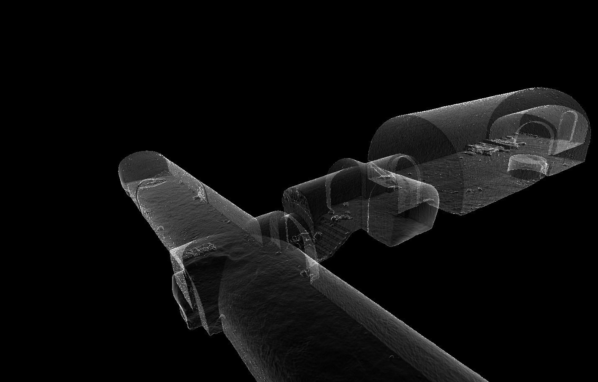
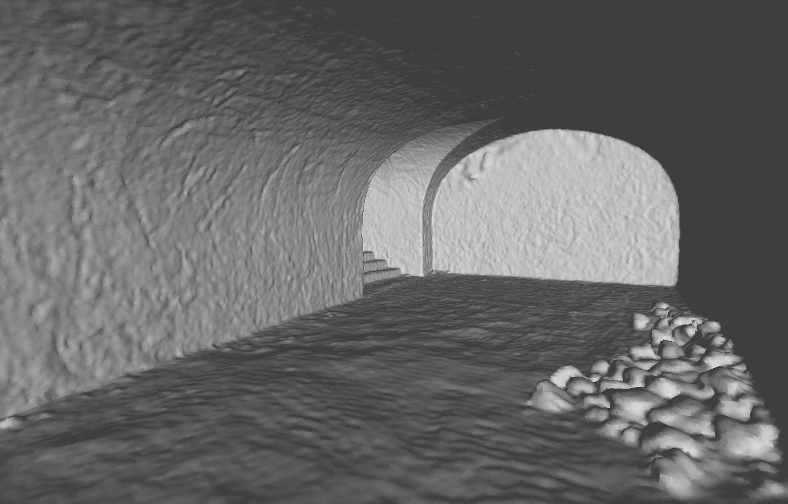
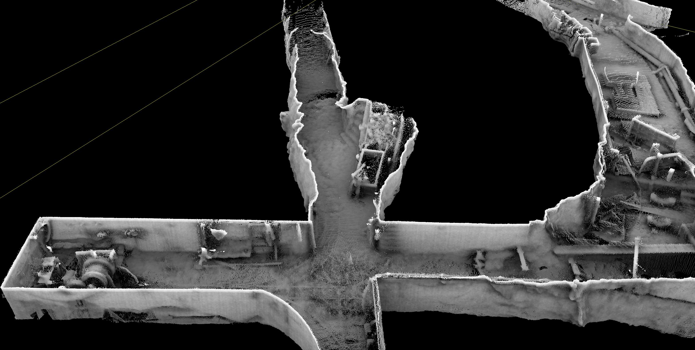
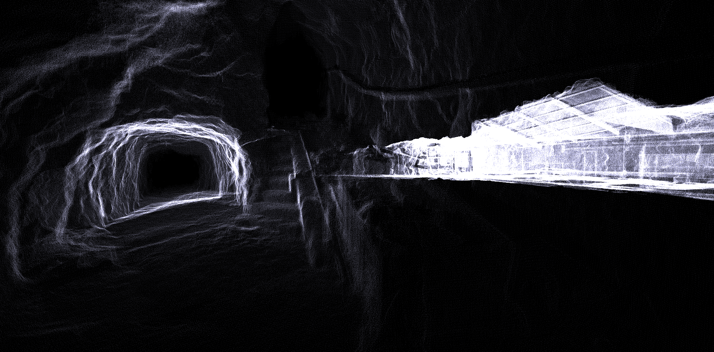

# LiDAR-Scanner
Un scanner 3D robuste et fiable développé pour la cartographie de reseaux souterrains

Vue du scanner pendant la cartographie d'une ancienne mine souterraine.

Tête rotative assurant la prise des mesures avec un LiDAR 2d Hokuyo UTM-30LX.

Reconstruction 3D d'une partie d'un ancien abris anti-aérien sous Paris à partir du nuage de points produit par le scanner.

Vue de l'intérieur du modèle.

Sous echantillonage du nuage de points par une grille de voxels.

Vue en coupe du nuage de point brut obtenu dans une ancienne mine souterraine.

Vue de l'interieur d'une galerie (nuage de points brut).
